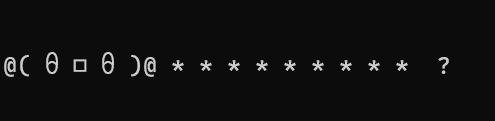
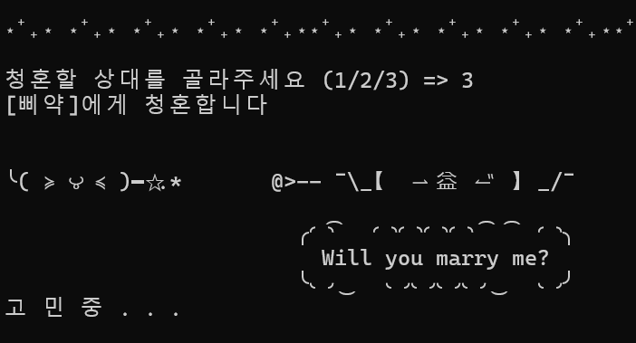
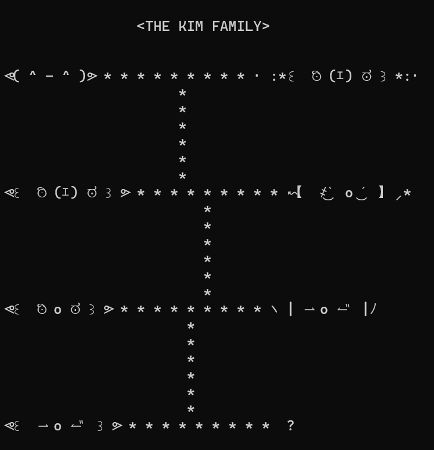

<!-- Improved compatibility of back to top link: See: https://github.com/othneildrew/Best-README-Template/pull/73 -->

<!-- PROJECT LOGO -->
 

  

<h3 align="center">GENE GACHA (유전 가챠)</h3>

  

    캐릭터 유전 터미널 게임
     
    <a href="https://github.com/github_suuxxirr/gene-gacha"><strong>코드 구경하기 »</strong></a>
     
  

## 프로젝트 개요 

**GENE GACHA(유전 가챠)** 는 파이썬을 이용한 터미널 게임입니다.

### Built With

* 

### 제작기간
> `2025.11.27` ~ `2025.11.29`

(<a href="#readme-top">맨 위로</a>)

## 설치 

1. 드라이브를 통해 압축파일 다운 받기 ([다운로드 링크](https://drive.google.com/drive/folders/1HCg8tSElVu8ZL207YXiMp_3nm8IGLyBn?usp=drive_link))
2. 파일 압축 해제
3. `run.bat` 파일 실행 

(<a href="#readme-top">맨 위로</a>)

## 플레이 예시
- 귀여운 캐릭터를 뽑아요

 

- 마음에 드는 상대에게 청혼해요

 

- 가문을 이어요

## 업데이트 예정

- [ ] 사용자 입력 예외처리
- [ ] 아이템 추가
- [ ] 청혼 승낙 확률 조정
 

(<a href="#readme-top">맨 위로</a>)

